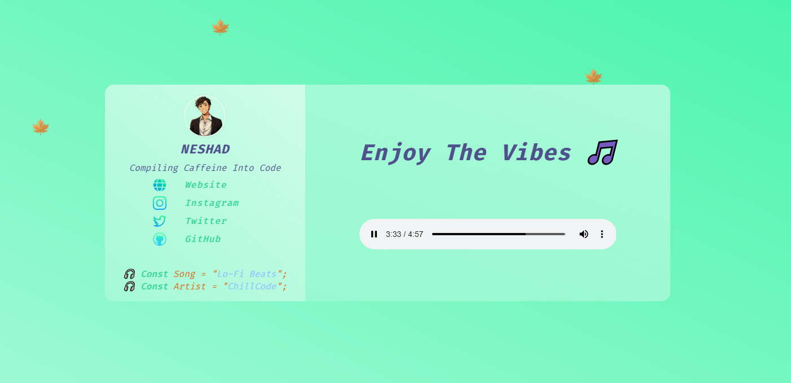

# 🎧 Vibe Loop

A soothing glassmorphic website built with **HTML** and **CSS**, featuring animated autumn leaves and chill lo-fi beats — perfect for vibing, relaxing, or coding in peace. The page blends aesthetic minimalism with audio-driven ambiance to reflect your personal brand.

---

## 🔴 Live Preview

🌐 [Vibe Loop – Live] ()

---

## 💡 Concept

 *"Enjoy The Vibes, One Beat at a Time 🎵🍁"*
---

- 🍁 **Autumn Leaves Animation** inspired by CSS keyframes
- 🎶 **Lo-Fi Beats** by ChillCode
- 🎨 Designed & Developed by [@neshadx](https://github.com/neshadx)

---

 🔄 *Built with coffee, code, and calm — loop the vibes and chill out.*

---
## 🛠️ What’s Inside

- ✅ HTML & CSS Only (No JavaScript required!)
- 🎨 Glass UI / Glassmorphism Design
- 🍃 CSS Keyframe Animations for Floating Leaves
- 🎧 HTML5 `<audio>` Embed for Lo-Fi Track
- 🧑‍💻 Personal Bio and Social Links
- 💻 Responsive Layout for All Screens

---

## 🔗 Technologies Used

- HTML5  
- CSS3  
- FontAwesome for Icons  
- Custom Keyframe Animations  
- Embedded Audio

---

## 🖼️ Preview

---

